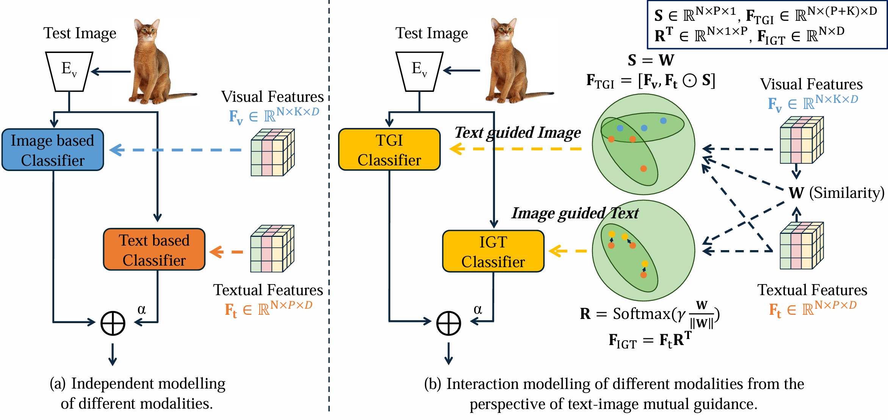

# TIMO

Official Pytorch Implementation of  [TIMO](https://arxiv.org/abs/2412.11375).

## Introduction
Contrastive Language-Image Pretraining (CLIP) has been widely used in vision tasks. Notably, CLIP has demonstrated promising performance in few-shot learning (FSL).
However, existing CLIP-based methods in training-free FSL (i.e., without the requirement of additional training) mainly learn different modalities independently, leading to two essential issues: 1) severe anomalous match in image modality; 2) varying quality of generated text prompts.
To address these issues, we build a mutual guidance mechanism, that introduces an Image-Guided-Text (IGT) component to rectify varying quality of text prompts through image representations, and a Text-Guided-Image (TGI) component to mitigate the anomalous match of image modality through text representations.
By integrating IGT and TGI, we adopt a perspective of Text-Image Mutual guidance Optimization, proposing TIMO.
Extensive experiments show that TIMO significantly outperforms the state-of-the-art (SOTA) training-free method. Additionally, by exploring the extent of mutual guidance, we propose an enhanced variant, TIMO-S, which even surpasses the best training-required methods by 0.33% with approximately ×100 less time cost.

<div align="center">
  
</div>

## Requirements
### Installation
Create a conda environment and install dependencies:
```
git clone https://github.com/lyymuwu/TIMO.git
cd TIMO

conda create -n TIMO python=3.8
conda activate TIMO

pip install -r requirements.txt
```

### Dataset
Follow [DATASET.md](https://github.com/gaopengcuhk/Tip-Adapter/blob/main/DATASET.md) to install ImageNet and other 10 datasets referring to CoOp.

## Get Started
### Configs

The running configurations can be modified in `configs/dataset.yaml`, user need to modify the root_path in configurations to the folder where dataset resides. 

Notes, `data_path` in `extract_features_all.py` need to be modified as well.


### Extracting Features
In this repo, we seperate the feature extraction and model inference. The features should be extracted first, then conduct model inference.

Extract the all image and textual features by running: 

```bash 
CUDA_VISIBLE_DEVICES=0 python extract_features_all.py
```
This command will extract features of various CLIP backbone architectures across all 11 datasets under 1/2/3 randomized seeds. The comprehensive execution of this command necessitates a substantial duration; thus, customization of its code may be warranted according to specific requirements.


### Model Inference 
Obtain the results under a specific dataset by running:

```bash 
CUDA_VISIBLE_DEVICES=0 python main.py --config configs/[dataset_name].yaml --shot [shot_number] --seed [seed_number]
```
users can test the proposed TIMO and TIMO-S, where you can change the `dataset_name`, `shot_number` and `seed_number`. `dataset_name` should be one of `[caltech101, dtd, eurosat, fgvc, food101, imagenet, oxford_flowers, oxford_pets, stanford_cars, sun397, ucf101]`, `shot_number` is chosen from 1/2/4/8/16 and `seed_number` can be any integer as long as its corresponding features has been extracted before.

Or use the following Linux command to simply reproduce the main results of our paper:

```bash 
bash run.sh
```


### Numerical Results

We provide TIMO's **numerical results** at [TIMO.txt](https://github.com/lyymuwu/TIMO/blob/main/outputs/TIMO.txt)
and [TIMO_S.txt](https://github.com/lyymuwu/TIMO/blob/main/outputs/TIMO_S.txt).


## Acknowledgements
This repo is build upon previous amazing repos include [TIP-Adapter](https://github.com/gaopengcuhk/Tip-Adapter/), [CLIP](https://github.com/openai/CLIP), [CoOp](https://github.com/KaiyangZhou/CoOp/), [SuS-X](https://github.com/vishaal27/SuS-X), [CuPL](https://github.com/sarahpratt/CuPL) [APE](https://github.com/yangyangyang127/APE) and [GDA-CLIP](https://github.com/mrflogs/ICLR24). Thanks for their contributions to the field.


## Citation

```
@article{Li_2024_Text,
  title={Text and Image Are Mutually Beneficial: Enhancing Training-Free Few-Shot Classification with CLIP},
  author={Li, Yayuan and Guo, Jintao and Qi, Lei and Li, Wenbin and Shi, Yinghuan},
  journal={arXiv preprint arXiv:2412.11375},
  year={2024}
}
```
